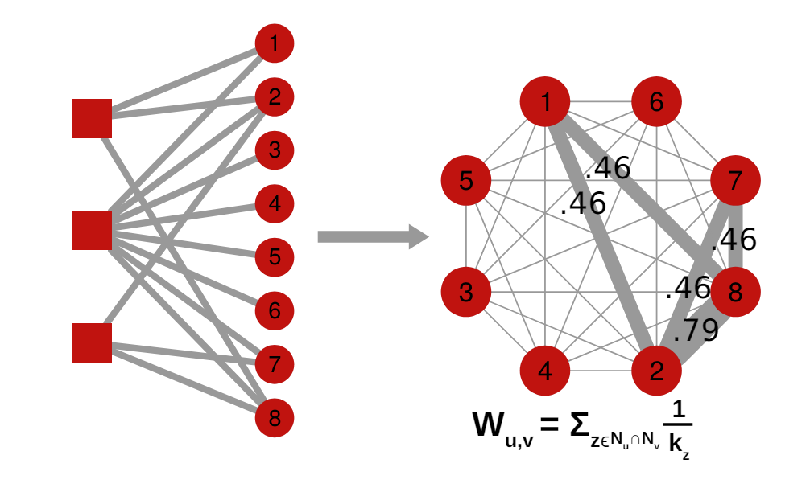

#### Different Network BackBone Extraction Methods
Source : [Altlas of Network Science](https://arxiv.org/abs/2101.00863) 
All the images and content are taken from Source.
##### Bi-partite Graph Projection
Projection of bi-partite graph with hyperbolic weight.  
Assumption:
- The hubs contribute less to the connection weight than non-hubs. For a connection given below:
  

  $$ w_(u,v) = \sum_{z \epsilon N_u \bigcap N_v } \frac{1}_{k_z -1} $$
  $$K_z is the degree of Z$$
  This method exaggerates the differences in weights so that thresholding becomes easier. The minus sign in the denominator never checks its similarity with itself.
  $$A*A^T$$ counts the degree.   

  Resource Allocation:  
  

  $$w_{u,v} = \frac{z \epsilon N_u \bigcap N_v} \frac{K_u}_{K_z}$$
  =
  

Disparity Filter:
- 

Bi-partite;
- Fixed Sequence Degree Method
- Fixed Fill Method
- Fixed Row Method
- Fixed Column Method
- The stochastic degree sequence model
- 
